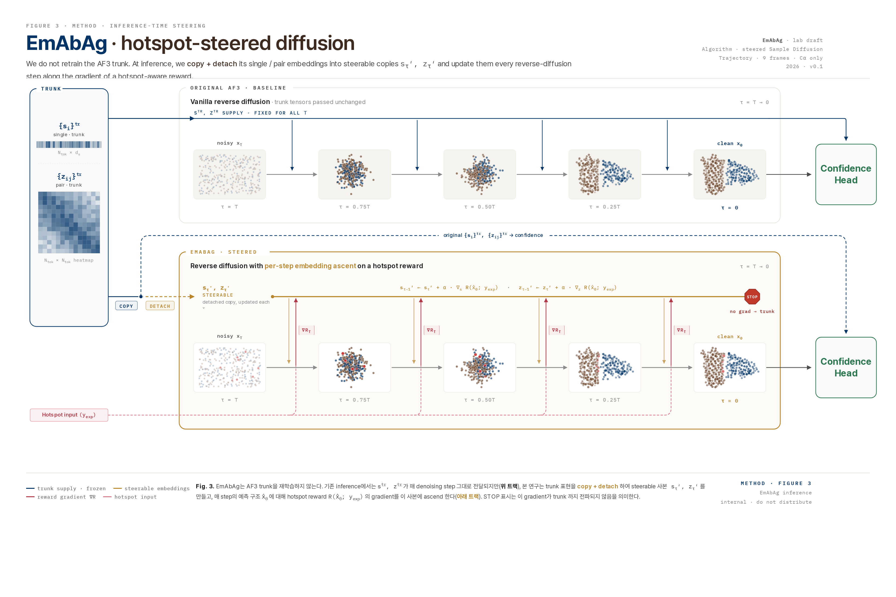

# SteerABLE-v1

Epitope-steered antibody–antigen structure prediction, built on
[Protenix-v1](https://github.com/bytedance/Protenix). The Protenix-v2 build of
the same method is [SteerABLE](https://github.com/bhyun-ans/SteerABLE); the two
share one steering algorithm and one command-line interface.

Tell the model where the antibody binds, and it builds that complex. SteerABLE-v1
turns a known or predicted epitope into a differentiable reward and uses it to
steer the pairformer trunk embeddings at every few diffusion steps. No
retraining, no change to the weights — the steering happens entirely at
inference time.

Without `--epitope_residue` this repository behaves exactly like upstream
Protenix-v1.



---

## Quickstart

```bash
pip install -e .

bash examples/steerable/7yds/prepare.sh   # unpack the bundled MSAs
bash examples/steerable/7yds/run.sh       # steer a Fab onto a known epitope
```

The model checkpoint (`protenix_base_default_v1.0.0`) downloads itself on
first use, into `~/checkpoint` (or `$PROTENIX_ROOT_DIR/checkpoint`). The
example needs one GPU and finishes in minutes.
[`examples/steerable/7yds/README.md`](examples/steerable/7yds/README.md)
walks through what comes out.

Your own target, in one command:

```bash
steerable-v1 pred \
    --input my_complex.json --out_dir ./out \
    --model_name protenix_base_default_v1.0.0 \
    --ab_chains "A,B" \
    --epitope_residue "C:45,C:48,C:52,C:120,C:121"
```

`--ab_chains` names the antibody chains; everything else is the antigen.
Epitope residues are `<chain>:<position>` with **1-based positions into the
sequence you put in the JSON**, not author or PDB numbering.

## Settings

Everything below is already the default. The epitope knobs mirror SteerABLE so
the two releases share one interface; the two rows marked ⚠ carry values that
were calibrated on Protenix-v2 and have **not** been re-validated on v1 — the
v1 benchmarks were produced with the gradient applied on every step, see
[Reproducing the v1 benchmarks](#reproducing-the-v1-benchmarks).

| setting | default | note |
|---|---|---|
| `--epitope_guidance_alpha` | `0.1` | calibrated on v1 (EmAbAg) and v2 alike |
| `--epitope_lambda_clash` | `0.1` | v1 benchmarks ran both `0.0` and `0.1` |
| `--epitope_guidance_interval` | `8` | ⚠ v2-calibrated; v1 benchmarks used `1` |
| `--gating_mode` | `steerable` | |
| `--dtype` | `bf16` | upstream default; what the v1 benchmarks used |
| top-k atom selection | `k = 1` | fixed, not configurable |
| Training-Free Guidance | — | Protenix-v1 has none; there is no TFG switch |

**`guidance_alpha` and `guidance_interval` were calibrated together.** The
per-update step size stays `guidance_alpha` whatever the interval, so the total
steering applied over the trajectory scales as roughly `1/interval`. Changing
one without the other moves you off a validated setting; treat any new pair as
something to re-validate, not a free speed knob.

## Installation

```bash
pip install -e .
```

Runtime and checkpoint dependencies follow upstream Protenix-v1. See
[docs/installation_and_inference.md](docs/installation_and_inference.md)
for the full setup guide, including MSA and template search and Docker.

No MSAs for your sequences? Generate them against a public server:

```bash
steerable-v1 msa --input my_complex.fasta --out_dir ./msa_out
```

### If the fused layernorm kernel will not build

Inherited from upstream Protenix, a custom CUDA layernorm kernel is JIT-compiled
on first use. On many clusters `nvcc` refuses the host compiler
(`error -- unsupported GNU version! gcc versions later than 11 are not
supported`) or the built extension cannot find its CUDA runtime
(`libcudart.so.11.0: cannot open shared object file`).

Either point the build at a compiler and CUDA runtime it accepts:

```bash
export PATH=/path/to/gcc-9/bin:$PATH
export CC=/path/to/gcc-9/bin/gcc CXX=/path/to/gcc-9/bin/g++
export LD_LIBRARY_PATH=/path/to/cuda-11.8/targets/x86_64-linux/lib:$LD_LIBRARY_PATH
```

or skip the kernel entirely and use PyTorch's own layernorm:

```bash
export LAYERNORM_TYPE=torch
```

The second costs some speed and nothing else. See [docs/kernels.md](docs/kernels.md)
for the other kernel switches.

## How it works

Ab–Ag complexes are among the hardest targets for structure prediction: the
interface is small, the paratope is diverse, and confidence-based sample
selection is unreliable. Prior knowledge of the epitope is often available —
from cross-linking, epitope mapping, phage display, or a companion epitope
predictor. Using that prior as a differentiable reward at inference time is
cheap and modular.

### Embedding-space epitope steering

At every steered step of the reverse diffusion trajectory, shift the pairformer
trunk output `(s_τ, z_τ)` so that the denoiser's clean-structure prediction
`x̂₀` places the epitope residues into contact with the antibody.

**Reward.** For each epitope residue `h`, take the softmin distance from its
single closest atom to the antibody atom set:

```
d_h = -(1/β) · log Σ_{a ∈ antibody} exp(-β · ‖x_h - x_a‖)
```

with `β = 10`. The per-residue penalty is flat-bottomed with contact distance
`d₀ = 4 Å`:

```
penalty(h) = softplus(d_h - d₀)²
Reward R   = -Σ_h penalty(h)
```

For homomeric antigens the mask includes every non-antibody chain, so an
epitope on any antigen copy is admissible. An additive clash reward based on
antibody × antigen vdW overlap is layered on at `lambda_clash = 0.1`.

**Update rule.** The trunk embeddings are treated as steerable state maintained
across diffusion steps:

```
s_τ, z_τ ← detach(s_trunk), detach(z_trunk)         # once, before the loop
for τ = T, T-1, …, 1:
    if τ is a steered step:
        s_τ.requires_grad_(True); z_τ.requires_grad_(True)
        with torch.enable_grad():
            x̂₀   = denoise(x_noisy_τ, t̂, s_τ, z_τ, features)
            R_τ  = Reward(x̂₀)
            g_s, g_z = ∇_{(s_τ, z_τ)} R_τ
        s_τ ← detach(s_τ) + α · RMS_normalize(g_s)
        z_τ ← detach(z_τ) + α · RMS_normalize(g_z)
    x_l ← Euler_step(x_noisy_τ, x̂₀, t̂, c_τ)
```

Two things are worth emphasising.

**The reward is evaluated on `x̂₀`, the denoiser's clean-structure prediction,
not on the noisy `x_{t-1}` that leaves the Euler step.** `x̂₀` is noise-free
throughout the trajectory, it is what the model *thinks* the final structure
looks like, and its gradient direction does not depend on the sampler's
step-size hyperparameters.

**The gradient magnitude is RMS-normalised**, so the effective step size `α` is
scale-invariant. Constant `α = 0.1` works best; `α = 1.0`, the flow-matching
paper value, over-steers by roughly 10× in this normalisation. A truncated
raised-cosine schedule is also available
(`--epitope.guidance_alpha null --epitope.alpha_init 0.1 --epitope.alpha_trunc 0.5`).

Every sample in a diffusion chunk is steered by its own reward gradient.
Differentiating the *sum* of per-sample rewards separates them exactly, because
`r_i` depends only on `s_τ[i]`, so there are no cross terms — a batched chunk
gives the same trajectories as running the samples one at a time.

### Where `x̂₀` comes from

Protenix-v1 runs AF3's Algorithm 18 as written: one call to the DiffusionModule
per step returns `x̂₀`, and the Euler step is applied to it directly. SteerABLE-v1
therefore simply runs that call under `torch.enable_grad()` on the steered
embeddings, differentiates the reward through it, and detaches before the Euler
step:

```python
# model/generator.py — inside the diffusion loop
s_τ.requires_grad_(True); z_τ.requires_grad_(True)

with torch.enable_grad():
    x̂₀ = denoise_net(x_noisy, t̂, s_trunk=s_τ, z_trunk=z_τ, ...)
    R  = contact_epitope_reward(x̂₀, mask_pairs, d0, β, top_k=1, per_sample=True)
    g_s, g_z = torch.autograd.grad(R.sum(), [s_τ, z_τ])

s_τ = (s_τ.detach() + α · RMS_normalize(g_s)).detach()
z_τ = (z_τ.detach() + α · RMS_normalize(g_z)).detach()
x_l = Euler_step(x_noisy, x̂₀.detach(), t̂, c_τ)
```

(In Protenix-v2 the same denoise call sits inside the Training-Free Guidance
engine, which is why SteerABLE needs a `return_x0` hook there. Protenix-v1 has
no TFG, so nothing of the sort is needed here.)

**Cost.** At `guidance_interval = 8`, 25 of the usual 200 diffusion steps carry
the reward backward and the other 175 are plain no-grad sampler steps on the
embeddings as they stand.

| Mode | Denoise calls/step | Backward passes/step | Wall time vs. plain v1 |
| --- | :---: | :---: | :---: |
| Baseline | 1 | 0 | 1.0× |
| Steering, every step (`interval 1`, the v1 benchmark regime) | 1 | 1 (reward) | ~1.7× |
| Steering, `interval 8` | 1 | 1 on 25/200 steps | well under that |

`--blocks_per_ckpt null` turns activation checkpointing off inside the
denoiser, which removes the recompute from the reward backward (1.4–2.3× on
the steered branch in our v2 measurements) at the cost of memory. It is safe
to use: the runner halves the diffusion sample chunk on CUDA OOM and, as a last
resort, restores checkpointing, so a large target completes slowly rather than
failing. Results are unchanged either way.

## Usage

### Several epitope hypotheses from one trunk

Separate epitope sets with `;` to steer towards each of them in one run:

```bash
steerable-v1 pred \
    -i input.json -o ./out -n protenix_base_default_v1.0.0 \
    --ab_chains "A,B" \
    --epitope_residue "C:45,C:48,C:52;D:120,D:121;C:10,C:11,C:14"
```

The pairformer trunk and its distogram are computed **once**; each set is then
sampled as its own diffusion branch (`steerable_0`, `steerable_1`, … in CLI
order) from that same trunk. Before each branch the trunk embeddings are
re-checked against a fingerprint taken right after the trunk, so a branch can
never start from a modified `(s, z)`; the RNG state is restored per branch, so
all branches share the same initial noise and per-step noise and differ only in
what they were steered towards.

This matters because trunks are not reproducible across processes: the MSA
subset is re-drawn every recycling cycle and Monte-Carlo dropout flips a coin
per forward, so epitopes compared across separate processes would have been
compared across different trunks.

Output layout with several sets: each branch gets its own sub-directory
(`./out/steerable_<k>/<name>/seed_<s>/predictions/`, `./out/raw/…`), and the
target's root directory holds only the trunk-level side-cars —
`<name>_gating.json` with one `epitopes` entry per set, and
`<name>_contact_probs.npz` whose `epitope_token_mask` becomes `[K, N_token]`.
A single set keeps the plain layout.

### Comparing against no guidance

`--gating_mode both` samples the steered branch *and* an unguided branch off the
same trunk, with matched noise, and writes the unguided one to `./out/raw/`.
That is the paired comparison you want when deciding whether steering helped on
a given target. It costs about twice as much.

**Use `both` rather than a separate unguided run, on Protenix-v1 especially.**
With an epitope configured, autograd is enabled for the whole forward, and
Protenix turns its in-place trunk operations off whenever grad is on. On
Protenix-v1 the in-place and out-of-place trunk paths are not bit-identical
(bf16 rounding in the chunked attention / triangle-update paths; measured on a
176-token target as max |Δz| ≈ 40 and contact probabilities up to 0.3 apart,
while on Protenix-v2 the two paths agree to the bit), and 200 diffusion steps
turn that into different samples. So the `raw` branch of a gated run shares its
trunk with the steered branch, as intended, but is *not* the same structure a
run without `--epitope_residue` would produce. Grad mode itself and activation
checkpointing (`--blocks_per_ckpt`) do not change the trunk; only the in-place
flag does.

### Reading the gate report

Every steered run writes `predictions/<name>_gating.json`. Besides the steering
trace and per-branch wall-clock, it reports **enrichment**: score each antigen
token by its best antibody contact probability in the unsteered trunk's
distogram, `e_j = max_{i ∈ Ab} C_ij`, then

```
enrichment = mean(e_j | j ∈ epitope) / mean(e_j | j elsewhere)
```

Around 1 means the trunk had no epitope signal of its own, so steering has the
most to add. A large value means raw Protenix was already heading there.
`--gating_mode route` turns this into an automatic decision against
`--gating.threshold`.

### Baseline

```bash
# plain Protenix-v1
steerable-v1 pred -i input.json -o ./out -n protenix_base_default_v1.0.0
```

### The runner entry point

`runner/inference.py` exposes the entire config tree as `--a.b.c value`, which
the CLI's curated option list does not. Use it for anything the CLI does not
reach, and for reproduction:

```bash
python runner/inference.py \
    --model_name protenix_base_default_v1.0.0 \
    --input_json_path input.json --dump_dir ./out \
    --seeds 101 \
    --ab_chains "A,B" --epitope_residue "C:45,C:48,C:52"
```

Every knob is documented in
[`configs/configs_inference.py`](configs/configs_inference.py).

## Reproducing the v1 benchmarks

The Protenix-v1 benchmarks were produced with EmAbAg, this repository's
predecessor, at settings that differ from today's defaults in one place: the
steering gradient was applied on **every** diffusion step. Reproduce that regime
with

```bash
python runner/inference.py \
    --model_name protenix_base_default_v1.0.0 \
    --input_json_path input.json --dump_dir ./out --seeds 101 \
    --sample_diffusion.N_sample 5 --sample_diffusion.N_step 200 \
    --infer_setting.sample_diffusion_chunk_size 1 \
    --use_template false --dtype bf16 \
    --epitope.guidance_interval 1 \
    --epitope.guidance_alpha 0.1 --epitope.lambda_clash 0.1 \
    --ab_chains "A,B" --epitope_residue "C:45,C:48,C:52"
```

(`--epitope.lambda_clash 0.0` for the no-clash arm.) With one sample per chunk
the per-sample machinery reduces exactly to EmAbAg's serial sampler, so this
command reproduces those runs bit for bit (verified under `--deterministic true`).
Note that the baseline arm of those benchmarks was a plain run, whose trunk
differs from the steered arms' trunk by the in-place rounding described under
[Comparing against no guidance](#comparing-against-no-guidance). `--epitope.guidance_interval 8`, the default,
was calibrated on Protenix-v2 and is offered on v1 for interface parity; validate
it on DockQ before relying on it.

Two further things to know when reproducing numbers:

- **Inference is deterministic but depends on the whole RNG consumption
  history.** One process that handles several targets draws a different MSA
  subset from the second target onward, so its trunk differs from a
  one-process-per-target run. Match the process layout, not just the seed.
- **Do not pool across GPU architectures.** Identical configurations on two
  different cards differed by 0.32 DockQ standard deviation in our v2 runs.
  Compare arms by paired deltas within a target.

## Repository layout

Guidance-related files. Everything outside this list is upstream Protenix-v1's
inference machinery, unchanged.

SteerABLE-v1 is **inference-only**: upstream's training and fine-tuning stack,
its training-data preparation scripts, and its benchmark reports for the other
Protenix checkpoints are not part of this repository. Use
[Protenix](https://github.com/bytedance/Protenix) if you need them.

| Path | Role |
| --- | --- |
| `protenix/model/steering.py` | Epitope contact reward, clash reward, mask builder, RMS normaliser, epitope-string parsing |
| `protenix/model/gating.py` | Distogram enrichment, branch naming and the raw-vs-steered routing gate |
| `protenix/model/generator.py` | `sample_diffusion()`: steered / frozen / baseline steps; `x̂₀` read straight from the DiffusionModule |
| `protenix/model/protenix.py` | Parses `epitope_residue` and `ab_chains`, builds `mask_pairs`, runs one trunk and one branch per epitope set |
| `protenix/model/modules/diffusion.py` | Accepts a per-sample `(s, z)` in `DiffusionConditioning` / `DiffusionModule` |
| `protenix/utils/alpha_schedule.py` | Truncated raised-cosine α-schedule |
| `configs/configs_inference.py` | `epitope_residue`, `ab_chains`, the `epitope.{…}` sub-config and the gating options |
| `runner/inference.py` | Drops `@torch.no_grad()` on `predict()`, activation-checkpointing restore, OOM backoff, branch-wise dumping |
| `runner/batch_inference.py` | The `steerable-v1` CLI, including the epitope options |
| `protenix/metrics/clash.py` | van der Waals radii behind the clash reward (also used by upstream's confidence path) |
| `docs/per_sample_batching.md` | Why per-sample steering needs a sample axis, and two RNG traps it exposes |
| `examples/steerable/7yds/` | A complete runnable example with bundled MSAs |

The importable Python package is still called `protenix`. That is deliberate:
it keeps this tree diffable and re-baseable against upstream. Only the
distribution and the console command are named `steerable-v1`.

## Citation

The SteerABLE preprint is in preparation; a citation will be added here once it
is posted. In the meantime, please cite Protenix and AlphaFold 3, whose model
and inference machinery SteerABLE-v1 builds on.

```bibtex
@article{Zhang2026.02.05.703733,
    author  = {Zhang, Yuxuan and Gong, Chengyue and Zhang, Hanyu and Ma, Wenzhi and Liu, Zhenyu and Chen, Xinshi and Guan, Jiaqi and Wang, Lan and Yang, Yanping and Xia, Yu and Xiao, Wenzhi},
    title   = {Protenix-v1: Toward High-Accuracy Open-Source Biomolecular Structure Prediction},
    journal = {bioRxiv},
    year    = {2026},
    doi     = {10.64898/2026.02.05.703733}
}

@article{abramson2024accurate,
    title   = {Accurate structure prediction of biomolecular interactions with AlphaFold 3},
    author  = {Abramson, Josh and Adler, Jonas and Dunger, Jack and others},
    journal = {Nature},
    volume  = {630},
    pages   = {493--500},
    year    = {2024}
}
```

## Attribution

SteerABLE-v1 is built on top of Protenix-v1 (ByteDance) and inherits its
architecture, weights and inference machinery. For LayerNorm and pairformer
implementations it inherits code from
[OneFlow](https://github.com/Oneflow-Inc/oneflow),
[FastFold](https://github.com/hpcaitech/FastFold) and
[OpenFold](https://github.com/aqlaboratory/openfold); see
[upstream Protenix](https://github.com/bytedance/Protenix) for details.

## License

Apache 2.0, inherited from upstream Protenix. See [LICENSE](LICENSE).
